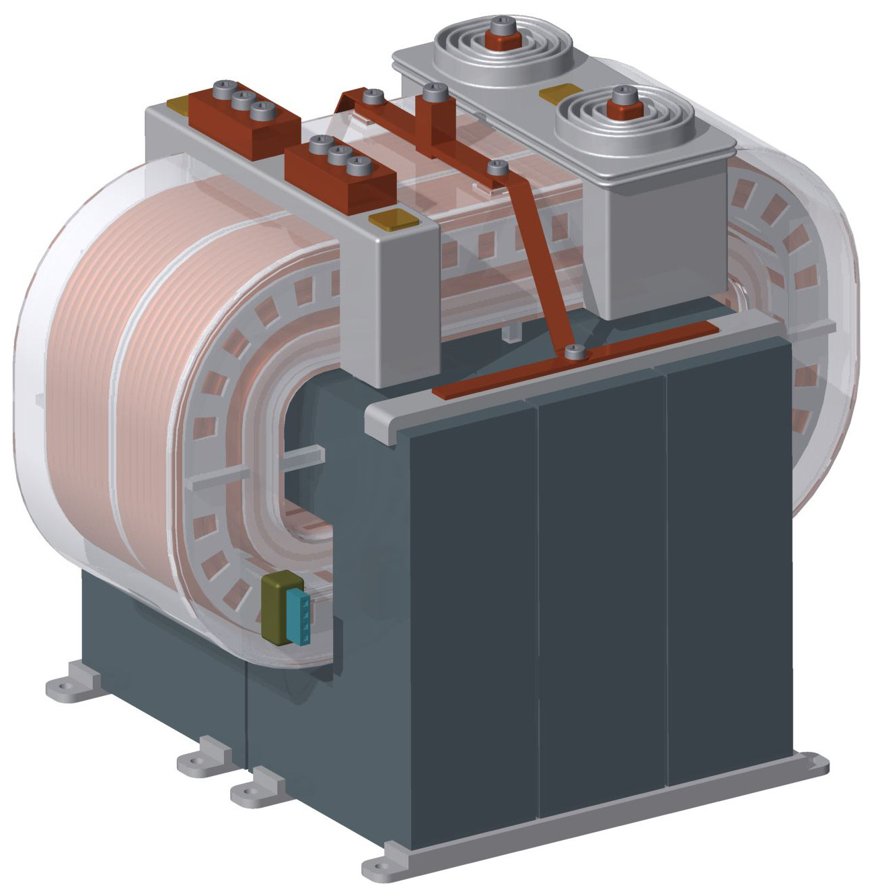
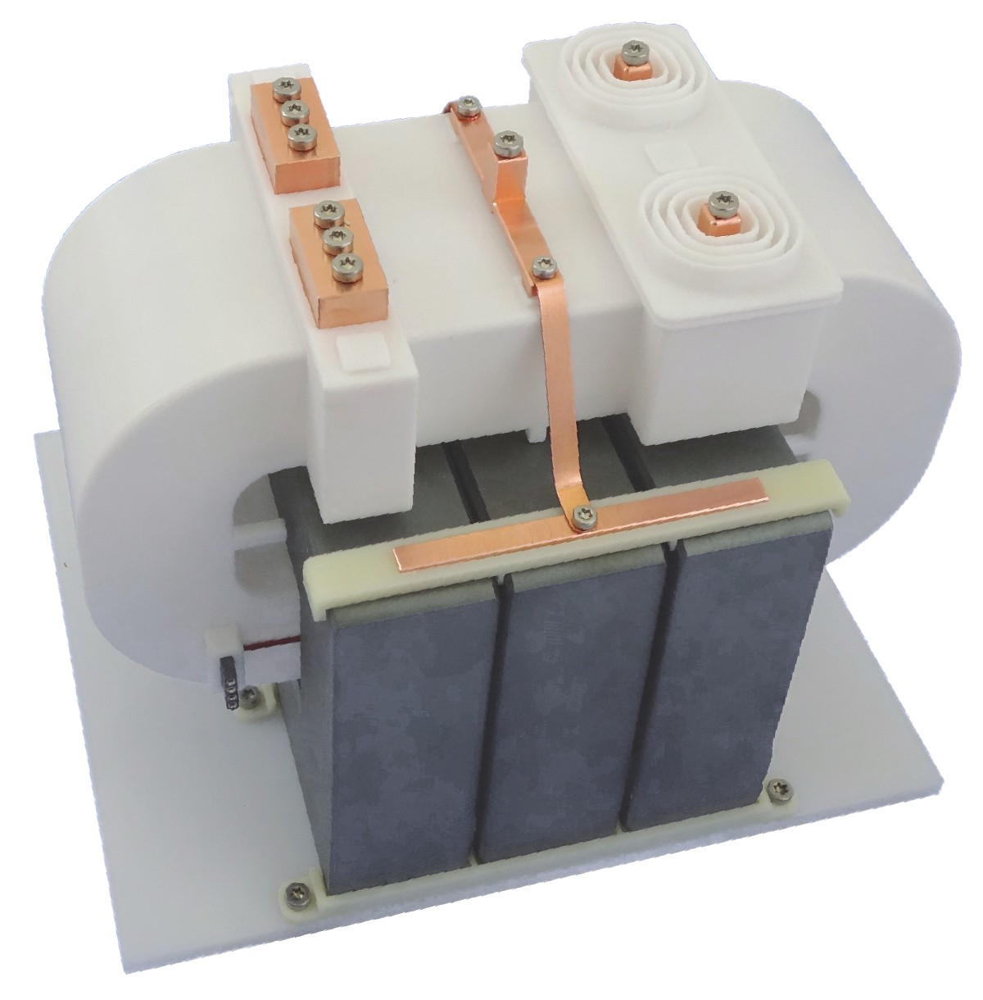

# 25kW/50kHz MF/MV Transformer / CAD files

This repository contains the **CAD files** for a 25kW/50kHz **medium-frequency and medium-voltage transformer**.
The transformer was used in a Solid-State Transformer (SST) demonstrator using 10 kV SiC MOSFETs.
This transformer feature a full-load efficiency of 99.65% with a power density of 7.4 kW/l.

The **transformer design, construction, and measurement** are presented in **following thesis**:
* Thomas Guillod (research group of Prof. Kolar)
* Modeling and Design of Medium-Frequency Transformers for Future Medium-Voltage Power Electronics Interfaces
* Doctoral Thesis, ETH Zurich, Switzerland, 2018
* https://doi.org/10.3929/ethz-b-000353785

## Part List

The following folders contain the parts in various formats:
* [drawing](drawing) - Technical drawings (PDF format)
* [inventor](inventor) - CAD source files (INVENTOR format)
* [step](step) - CAD export files (STEP format)

Additionnaly, the following parts are used:
* Fan Connector : Phoenix 1899139
* NTC Connector : 3M 960104-6202-AR
* Axial Fan: Sunon ME50100V1-000U-A99 	
* Magnetic Core: Blinzinger U93/60/30 (customized U93/76/30)
* LV Litz Wire : Von Roll  Litz 2500x100 um (custom design)
* HV Litz Wire : Pack Litz 630x71 um (custom design)

### Gallery

    
    

## Author

* **Thomas Guillod, ETH Zurich, Power Electronic Systems Laboratory** - [GitHub Profile](https://github.com/otvam)

## License

* This project is licensed under the **Creative Commons — CC BY 4.0**, see [LICENSE.md](LICENSE.md).
* This project is copyrighted by: (c) 2016-2018, ETH Zurich, Power Electronic Systems Laboratory, T. Guillod.
